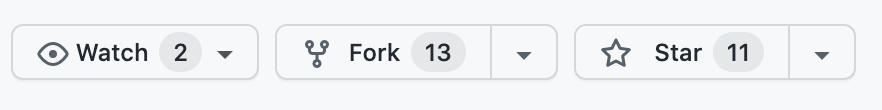
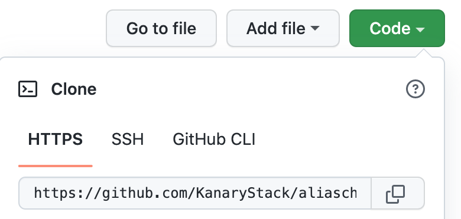

# Contributing to AliasCheck - Frontend (Client)

❤ Thank you for your interest to contribute 🎉🎉🎉

Below are set of guidelines for contributing to AliasCheck and its packages. These are mostly guidelines, not rules. Use your best judgment, and feel free to propose changes to this document in a pull request.

### <u>TABLE OF CONTENT</u>

- <a href="#codeGuidelines">Code Guidelines</a>
- <a href="#contributing">How to Contribute</a>
- <a href="#proposeIssue">How to Propose A New Issue</a>
- <a href="#PRGuides">Pull Request Guides</a>
- <a href="#forkrepo">Fork a Repository - Step by Step</a>

---

## <b id="codeGuidelines">Code Guidelines</b>

- Write comprehensive and robust tests that cover the changes you've made in your work.

* Follow the appropriate code style standards for the language and framework you're using.
* Write readable code – keep functions small and modular and name variables descriptively.
* Document your code thoroughly.
* Make sure all the existing tests pass.
* User-facing code should support the following browsers:
  Chrome (Webkit-Blink / 22+),
  Firefox (Gecko / 28+),
  Edge (Chromium based / 12+),
  Opera (Chromium-Blink / 12.1+),
  Safari (Apple’s Webkit / 7+),
  IE 11 (Trident)

## <b id="contributing">How to Contribute</b>

Once you've found an issue you'd like to work on, please follow these steps to make your contribution:

1. Comment on it and say you're working on that issue. This is to avoid conflicts with others also working on the issue. You will be required to be present for the community standups so as to ensure that the entire team is kept in view of your progress.
   > Please note that if you indicate interest and do not show any form of activeness by joining the community standups, and contributing in the available slack channels for 2 weeks, we would assume that you no longer have interest contributing to the selected issue
2. Submit your pull request and wait for your code review. Be sure to read and follow our <a href="#PRGuides">pull request guidelines!</a>
3. Wait for code review and address any issues raised as soon as you can.

> We encourage people to collaborate as much as possible. When you reviewing each other pull requests be kind and constructive. We especially appreciate contributors reviewing each others pull requests.

## <b id="proposeIssue">How to Propose A New Issue</b>

If you want to work on something that there is no GitHub issue for, kindly follow these steps:

- Create a new GitHub issue associated with the relevant repository and propose your change there. Be sure to include implementation details and the rationale for the proposed change.
- We are very reluctant to accept random pull requests without a related issue created first. This would mean that all pull request must be associated with an issue.
- Wait for a project maintainer to evaluate your issue and decide whether it's something that we will accept a pull request for.
- Once the project maintainer has approved the issue you may start work on code as described in the <a href="#contributing">How to contribute</a> section above.

## <b id="PRGuides">Pull Request Guides</b>

This guide is for both first time contributors and previous contributors.

- You are required to create a separate branch for each issue that you're working on. Do not make changes to the default branch of your fork. See how to <a href="#forkrepo">Fork A Repository</a>
- Push your code once you are done solving the issue or at a stage where you require review of your progress.
- Make a pull request when you can.
  > If you are still working on the issue but have opened a draft pull request, please mark the title with a <i><strong>[WIP]</strong></i>

> Pull Request with a <i><strong>[WIP]</strong></i> title wil not be reviewed.

> Note that all pull requests must be linked to an issue else it would not be giving attention.. see <a href="#proposeIssue">How to Propose A New Issue</a> section above.

- Describe your pull request in detail. Too much detail is always better than too little

  > If you are not the author of an issue please tag the actual issue author. using @[author] ( This brings the reporter of the issue into the conversation )

- Check the Preview tab to make sure the Markdown is correctly rendered and that all tags and references are linked. If not, go back and edit the Markdown.

- Once your PR is ready, remove the <i><strong>[WIP]</strong></i> from the title and/or change it from a draft PR to a regular PR.
- If a specific reviewer is not assigned automatically, please request a review from the project maintainer [@simplytunde](https://github.com/simplytunde) and any other interested parties manually

Backend - [@ChubaOraka](https://github.com/ChubaOraka), [@KiptoonKipkurui](https://github.com/KiptoonKipkurui)

Frontend - [@Maxwell-ihiaso](https://github.com/Maxwell-ihiaso), [@RWambui](https://github.com/RWambui)

---

- If your PR gets a 'Changes requested' review, you will need to address the feedback and update your PR by pushing to the same branch. You don't need to close the PR and open a new one.
- Be sure to re-request review once you have made changes after a code review.
- Asking for a re-review makes it clear that you addressed the changes that were requested and that it's waiting on the maintainers instead of the other way round.

## <b id="forkrepo">Fork a Repository</b>

**Guide to get started with forking a repository**

1. On the [Github page for this repository](https://github.com/KanaryStack/aliascheck), click on "Fork"



<br>

2. Clone your forked repository to your computer:



✅run this command inside your terminal:

```
git clone https://github.com/KanaryStack/aliascheck.git
```

see more about [forking]() and [cloning a repo]()

3. Shift to project directory:

```
cd aliascheck/client
```

4. Before making any changes, keep your forked repository in sync to avoid merge conflicts:

```
git remote add upstream https://github.com/KanaryStack/aliascheck.git
git pull upstream main
```

If you run into a merge conflict, you have to resolve the conflict. You can find online guides [here](https://opensource.com/article/20/4/git-merge-conflict)

5. after adding the upstream and checking that all files are up to date, you can now create a new branch before editing any files. You can achieve that in two ways:

```
git checkout -b <branch-name>
```

```
git branch <name-of-your-branch>
git switch <name-of-your-branch>
```

6. On your directory, open text editor and add your changes/components

7. Add the changes with git add, git commit ([write a good commit message](https://cbea.ms/git-commit/));

```
git add src/hero/index.tsx
git commit -m "updated hero component"
```

8. Push your changes to your repository:

```
git push origin <your-branch-name>
```

9. Go to the Github page of your fork, and make a pull request:

If you want to see more on the [pull request pages](https://docs.github.com/en/pull-requests/collaborating-with-pull-requests/proposing-changes-to-your-work-with-pull-requests/creating-a-pull-request)

10. Wait for one of the maintainers to merge your pull request. If you experience any conflict, you will be alerted.

11. Don't be shy and enjoy creating things together!
